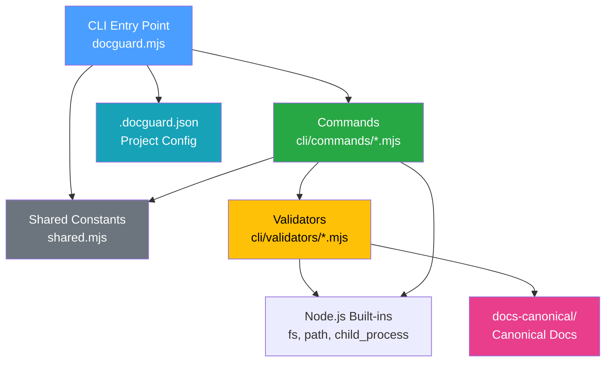

# Architecture

<!-- docguard:version 0.4.0 -->
<!-- docguard:status active -->
<!-- docguard:last-reviewed 2026-03-13 -->

| Metadata | Value |
|----------|-------|
| **Status** |  |
| **Version** | `0.4.0` |
| **Last Updated** | 2026-03-13 |
| **Project Size** | 30+ files, ~6K lines |

---

## System Overview

DocGuard is a zero-dependency Node.js CLI tool. It enforces **Canonical-Driven Development (CDD)** — a methodology where documentation is the source of truth. DocGuard audits, scores, and guards project documentation. It generates AI-actionable fix prompts and integrates with CI/CD pipelines and VS Code.

It targets development teams and AI coding agents that need to maintain documentation quality across projects of any stack (JavaScript, Python, Java, etc.).

## Component Map

| Component | Responsibility | Location | Key Files |
|-----------|---------------|----------|-----------|
| **CLI Entry Point** | Argument parsing, config loading, command routing | `cli/` | `docguard.mjs` |
| **Commands** | 15 user-facing commands (diagnose, guard, init, score, fix, generate, diff, agents, trace, ci, watch, hooks, badge, llms, publish) | `cli/commands/` | `*.mjs` |
| **Validators** | 19 independent validation modules that check specific aspects of CDD compliance | `cli/validators/` | `*.mjs` |
| **Templates** | Document skeletons (ARCHITECTURE, SECURITY, etc.) and slash command files for AI agents | `templates/` | `*.template`, `commands/*.md` |
| **Extension** | Spec Kit extension with 4 AI skills, 4 bash scripts, workflow hooks | `extensions/spec-kit-docguard/` | `skills/*/SKILL.md`, `scripts/bash/*.sh` |
| **VS Code Extension** | Status bar score, inline diagnostics, Code Actions, file watchers | `vscode-extension/` | `extension.js`, `package.json` |
| **Tests** | Command-level integration tests using `node:test` | `tests/` | `commands.test.mjs` |
| **Scanners** | Project file scanners for test discovery, route detection, service mapping | `cli/scanners/` | `*.mjs` |

## Tech Stack

| Category | Technology | Rationale |
|----------|-----------|-----------|
| Language | JavaScript (ES Modules) | Universal runtime, zero-friction `npx` usage |
| Runtime | Node.js ≥ 18 | Native `node:test`, `node:fs`, `node:child_process` |
| Dependencies | **None** (zero-dependency) | Maximizes portability, eliminates supply chain risk |
| Package Manager | npm | Standard for Node.js CLIs |
| Testing | `node:test` + `node:assert` | Built-in, no test framework dependency |
| Extension | VS Code Extension API | Dominant editor market share |

### Recognized Config Files

DocGuard recognizes and validates these project config files:

| File | Purpose |
|------|---------|
| `.docguard.json` | Project-level DocGuard configuration |
| `.docguardignore` | Per-project file exclusions (like `.gitignore`) |
| `vitest.config.ts` / `jest.config.ts` | Test runner config (scanned for custom test patterns) |
| `.storybook/` | Component documentation tool (detected for docs-coverage) |

## Layer Boundaries

The architecture follows a strict 4-layer model where each layer can only import from the layers below it.

| Layer | Contains | Can Import From | Cannot Import From |
|-------|----------|----------------|--------------------|
| **Extension** (`extensions/spec-kit-docguard/`) | AI skills (SKILL.md), bash scripts, hooks, commands | CLI (via npx), Node.js built-ins | Isolated — spec-kit integration layer |
| **Commands** (`cli/commands/`) | User-facing command logic | Validators, Config (via `docguard.mjs` exports) | Isolated — each command is self-contained |
| **Validators** (`cli/validators/`) | Independent validation modules | Node.js built-ins only (`fs`, `path`, `child_process`) | Isolated — pure functions only |
| **Entry Point** (`cli/docguard.mjs`) | Config loading, ANSI colors, argument parsing, command dispatch | Commands (imports all command modules) | Calls validators only through commands |

**Key Rule**: Validators are pure functions. They receive `projectDir` and `config`, then return results. They stay isolated from commands and the CLI entry point. The Extension layer operates independently, using the CLI as an external tool.



## Data Flow

### Request Lifecycle: `docguard guard`

```
User runs: npx docguard guard
     │
     ▼
docguard.mjs
  ├── parseArgs(process.argv)      → flags: { format, dir, ... }
  ├── loadConfig(projectDir)       → .docguard.json → merged with defaults
  │     ├── Reads .docguard.json
  │     ├── Reads package.json (name, type detection)
  │     └── Merges: defaults ← config ← CLI flags
  │
  ▼
guard.mjs
  ├── For each enabled validator:
  │     ├── structure.mjs    → checks docs-canonical/ exists, required files present
  │     ├── docs-sync.mjs    → checks DocGuard metadata headers
  │     ├── drift.mjs        → checks DRIFT-LOG.md for staleness
  │     ├── changelog.mjs    → checks Unreleased section, version entries
  │     ├── architecture.mjs → validates component map, layer boundaries
  │     ├── test-spec.mjs    → checks test framework, coverage docs
  │     ├── security.mjs     → checks auth, secrets documentation
  │     ├── environment.mjs  → checks setup steps, env vars documentation
  │     └── freshness.mjs    → checks git commit dates vs doc last-modified
  │
  ├── Collects: { pass: [...], warn: [...], fail: [...] }
  │
  ▼
Output (text | json)
  └── Exit code: 0 (pass) | 1 (fail) | 2 (warn)
```

### AI Fix Flow: `docguard fix --doc architecture`

```
fix.mjs
  ├── Looks up DOC_EXPECTATIONS['docs-canonical/ARCHITECTURE.md']
  ├── assessDocQuality(content, expectations)
  │     └── Checks: line count, placeholder count, content quality signals
  ├── Outputs: TASK, PURPOSE, RESEARCH STEPS, WRITE THE DOCUMENT
  │
  ▼
AI Agent (Claude Code, Cursor, Copilot, etc.)
  ├── Reads stdout (the research instructions)
  ├── Executes research: reads package.json, scans directories, maps imports
  ├── Writes docs-canonical/ARCHITECTURE.md with real content
  │
  ▼
docguard guard → validates the newly written document
```

## Key Design Decisions

| Decision | Rationale |
|----------|-----------|
| **Zero dependencies** | CLI tools should install instantly. Avoiding `node_modules` eliminates supply chain risk and version conflicts. |
| **Config-driven validation** | `.docguard.json` lets projects customize which validators run. A CLI project can skip database docs. |
| **Validators are independent** | Each validator is a self-contained module. Adding a validator keeps existing ones stable. |
| **AI as author, CLI as orchestrator** | The CLI detects problems and generates structured prompts. Documentation writing is the AI's responsibility. |
| **Exit codes for CI** | `0` (pass), `1` (fail), `2` (warn) enables `docguard ci` to gate deployments. |

---

## External Dependencies

DocGuard has **zero runtime dependencies**. All functionality uses Node.js built-in modules.

| Module | Usage |
|--------|-------|
| `node:fs` | File system operations (read docs, check existence) |
| `node:path` | Path resolution and manipulation |
| `node:child_process` | Git operations (freshness checks) |
| `node:url` | ES Module URL resolution |
| `node:readline` | Interactive prompts (init command) |
| `node:test` | Built-in test framework |
| `node:assert` | Test assertions |
| `node:os` | Temp directory for tests |

**Dev dependencies**: None. Tests use `node:test` (built-in since Node.js 18).

---

## Revision History

| Version | Date | Author | Changes |
|---------|------|--------|---------|
| 0.4.0 | 2026-03-13 | DocGuard Team | Complete rewrite with real project data, AI orchestration architecture |
| 0.1.0 | 2026-03-13 | DocGuard Generate | Auto-generated skeleton |
