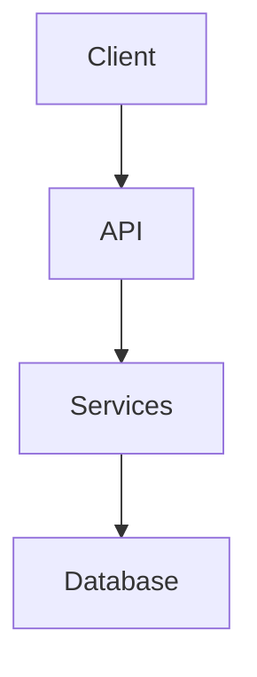

# Architecture

<!-- specguard:version 0.1.0 -->
<!-- specguard:status draft -->
<!-- specguard:last-reviewed 2026-03-13 -->
<!-- specguard:generated true -->

> **Auto-generated by SpecGuard.** Review and refine this document.

| Metadata | Value |
|----------|-------|
| **Status** |  |
| **Version** | `0.1.0` |
| **Last Updated** | 2026-03-13 |
| **Project Size** | 18 files, ~4K lines |

---

## System Overview

<!-- TODO: Describe what this system does and who it's for -->
specguard is a JavaScript application.

## Component Map

| Component | Responsibility | Location | Tests |
|-----------|---------------|----------|-------|
| <!-- Add components --> | | | |

## Tech Stack

| Category | Technology | Version | License |
|----------|-----------|---------|---------|
| Language | JavaScript | | |

## Layer Boundaries

<!-- TODO: Define which layers can import from which -->

| Layer | Can Import From | Cannot Import From |
|-------|----------------|-------------------|

## Diagrams

---

## Revision History

| Version | Date | Author | Changes |
|---------|------|--------|---------|
| 0.1.0 | 2026-03-13 | SpecGuard Generate | Auto-generated from codebase scan |
